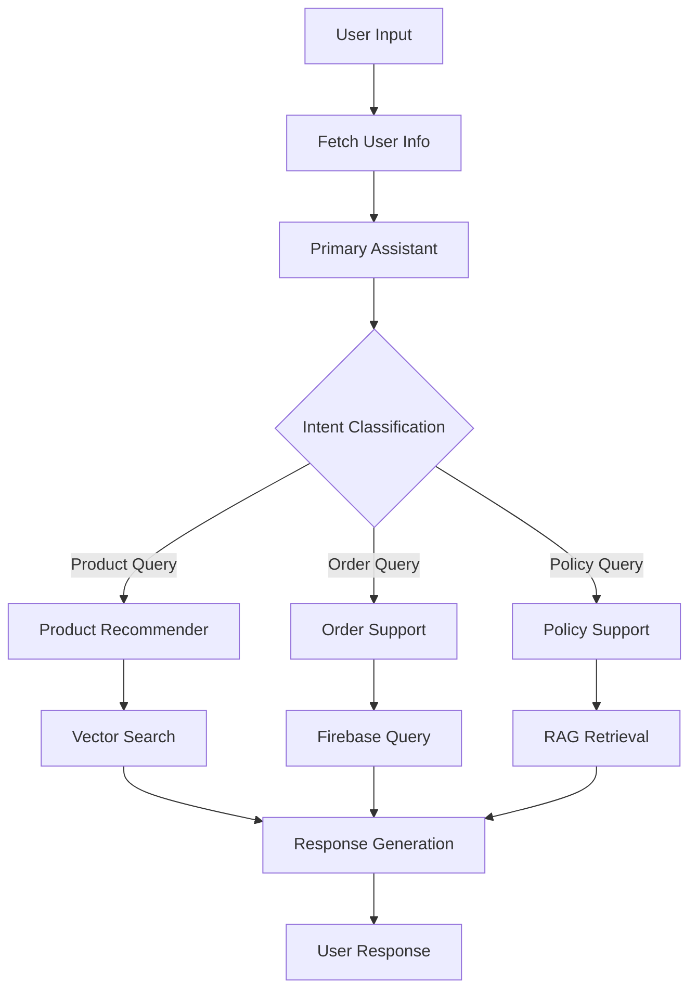

# Customer Support System - Multi-Agent AI

A sophisticated multi-agent customer support system built with LangGraph, featuring intelligent routing, RAG-based knowledge retrieval, and Firebase integration for real-time data management.

## 🏗️ System Architecture

### Multi-Agent Framework
The system employs a **hierarchical multi-agent architecture** using LangGraph for orchestration:

```
Primary Assistant (Router)
├── Product Recommender Agent
├── Order Support Agent  
├── Policy Support Agent
└── User Info Manager
```

### Core Components

#### 1. **Primary Assistant** (`main.py`)
- **Role**: Central coordinator and conversation manager
- **Capabilities**: 
  - Intent classification and routing
  - User greeting and context management
  - Agent delegation and escalation handling
- **Tools**: User details fetching, agent routing tools

#### 2. **Product Recommender Agent**
- **Role**: AI-powered product discovery and recommendations
- **Technology**: RAG (Retrieval-Augmented Generation) with FAISS vector search
- **Features**:
  - Semantic product search using sentence transformers
  - Vector similarity matching
  - Product catalog indexing from CSV data
- **Tools**: `serach_product()` - Vector-based product search

#### 3. **Order Support Agent**
- **Role**: Order management and customer service
- **Capabilities**:
  - Order status tracking
  - Order history retrieval
  - Customer order analytics
- **Tools**: `fetch_order_details()`, `fetch_user_details()`

#### 4. **Policy Support Agent**
- **Role**: Company policy guidance and compliance
- **Technology**: RAG with Gemini embeddings
- **Features**:
  - Policy document search and retrieval
  - Context-aware policy recommendations
- **Tools**: `lookup_policy()` - Semantic policy search

## 🛠️ Technical Stack

### Core Technologies
- **LangGraph**: Multi-agent orchestration and workflow management
- **LangChain**: LLM integration and tool management
- **Google Gemini**: Primary language model (gemini-2.0-flash-exp)
- **Firebase Firestore**: Real-time database for user and order data
- **FAISS**: Vector database for product similarity search
- **LlamaIndex**: Document indexing and retrieval framework

### AI/ML Components
- **Embeddings**: 
  - Sentence Transformers (`all-MiniLM-L6-v2`) for product search
  - Google Gemini embeddings for policy search
- **Vector Stores**: FAISS for efficient similarity search
- **RAG Pipeline**: Custom implementation for knowledge retrieval

## 📁 Project Structure

```
customer_support_system/
├── main.py                 # Main application and agent orchestration
├── src/
│   ├── firebase_manager.py    # Firebase Firestore integration
│   ├── custom_tool.py         # User and order management tools
│   ├── policy_rag.py          # Policy search and retrieval
│   └── product_recomentaion_rag.py  # Product recommendation engine
├── requirements.txt        # Python dependencies
├── graph_diagram.png      # System architecture visualization
└── README.md             # This documentation
```

## 🔧 Key Features

### 1. **Intelligent Conversation Flow**
- **State Management**: Persistent conversation state with dialog stack
- **Context Preservation**: User information maintained across interactions
- **Seamless Handoffs**: Smooth transitions between specialized agents

### 2. **Advanced Search Capabilities**
- **Semantic Product Search**: Vector-based similarity matching
- **Policy Knowledge Base**: RAG-powered policy retrieval
- **Order Intelligence**: Smart order lookup and analysis

### 3. **Firebase Integration**
- **Real-time Data**: Live user and order information
- **Scalable Storage**: Cloud-based data management
- **User Authentication**: Secure user identification and data access

### 4. **Error Handling & Fallbacks**
- **Graceful Degradation**: Fallback responses when services unavailable
- **Tool Error Recovery**: Automatic error handling with user feedback
- **Connection Resilience**: Robust Firebase connection management

## 🚀 System Workflow

### 1. **User Interaction Flow**


### 2. **Agent Communication**
- **Tool-based Routing**: Pydantic models for structured agent communication
- **State Synchronization**: Shared state across all agents
- **Escalation Handling**: `CompleteOrEscalate` tool for agent transitions

## 📊 Performance Characteristics

### Search Performance
- **Product Search**: Sub-second vector similarity search
- **Policy Retrieval**: Optimized embedding-based matching
- **Order Lookup**: Direct Firebase queries with indexing

### Scalability
- **Concurrent Users**: Stateless agent design supports multiple sessions
- **Data Growth**: Vector indices scale with product catalog size
- **Cloud Integration**: Firebase provides automatic scaling

## 🔐 Security & Privacy

### Data Protection
- **Firebase Security Rules**: Controlled data access
- **User Authentication**: UID-based user identification
- **API Key Management**: Secure credential handling

### Privacy Compliance
- **Data Minimization**: Only necessary user data collected
- **Session Isolation**: User conversations kept separate
- **Audit Trail**: Comprehensive logging for compliance

## 📈 Analytics & Monitoring

### Conversation Analytics
- **Intent Distribution**: Track user query patterns
- **Agent Performance**: Monitor response quality and speed
- **User Satisfaction**: Conversation completion rates

### System Metrics
- **Response Times**: End-to-end latency monitoring
- **Error Rates**: Tool failure and recovery tracking
- **Resource Usage**: Memory and compute optimization

## 🛡️ Error Handling

### Robust Fallback System
```python
# Example fallback implementation
def handle_tool_error(state) -> dict:
    error = state.get("error")
    tool_calls = state["messages"][-1].tool_calls
    return {
        "messages": [
            ToolMessage(
                content=f"Error: {repr(error)}\n please fix your mistakes.",
                tool_call_id=tc["id"],
            )
            for tc in tool_calls
        ]
    }
```

### Error Recovery Strategies
- **Tool Failures**: Automatic retry with fallback responses
- **API Timeouts**: Graceful degradation with cached responses
- **Data Unavailability**: Informative error messages to users

## 🔄 Continuous Improvement

### Learning Mechanisms
- **Conversation Logs**: Analysis for system improvement
- **User Feedback**: Integration points for satisfaction tracking
- **A/B Testing**: Framework for feature experimentation

### Model Updates
- **Embedding Refresh**: Periodic retraining of vector models
- **Policy Updates**: Dynamic policy document synchronization
- **Product Catalog**: Real-time inventory and catalog updates

## 📋 Installation & Setup

### Prerequisites
```bash
# Python 3.8+
pip install -r requirements.txt
```

### Configuration
1. **Firebase Setup**: Add Firebase credentials JSON
2. **API Keys**: Configure Google Gemini API key
3. **Data Sources**: Prepare product CSV and policy documents

### Running the System
```bash
python main.py
```

## 🎯 Use Cases

### Customer Service Scenarios
- **Product Discovery**: "I need running shoes for marathons"
- **Order Tracking**: "What's the status of my recent order?"
- **Policy Questions**: "What's your return policy for electronics?"
- **Complex Queries**: Multi-intent conversations with agent handoffs

### Business Applications
- **E-commerce Support**: Complete customer service automation
- **Knowledge Management**: Intelligent policy and procedure guidance
- **Sales Assistance**: AI-powered product recommendations
- **Customer Analytics**: Conversation insights and behavior analysis

## 🔮 Future Enhancements

### Planned Features
- **Voice Integration**: Speech-to-text and text-to-speech capabilities
- **Multilingual Support**: Multi-language conversation handling
- **Advanced Analytics**: ML-powered conversation insights
- **API Gateway**: RESTful API for external integrations

### Technical Roadmap
- **Performance Optimization**: Caching and response time improvements
- **Scalability Enhancements**: Distributed agent deployment
- **Security Hardening**: Advanced authentication and authorization
- **Integration Expansion**: CRM and helpdesk system connections

---

## 📞 Support & Contact

For technical support, feature requests, or contributions, please refer to the project documentation or contact the development team.

**System Status**: ✅ Production Ready  
**Last Updated**: January 2025  
**Version**: 1.0.0