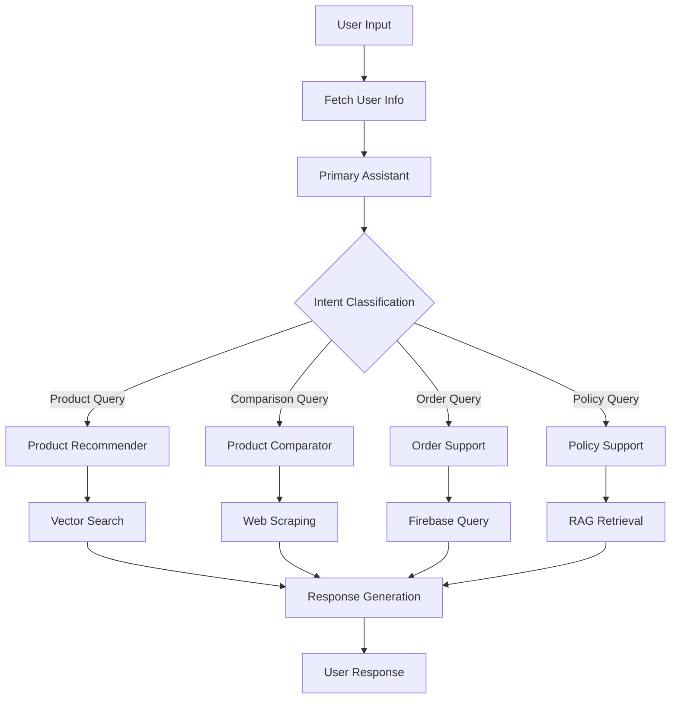

# Customer Support System - Multi-Agent AI

A sophisticated multi-agent customer support system built with LangGraph, featuring intelligent routing, RAG-based knowledge retrieval, Firebase integration, and FastAPI web service for real-time customer interactions.

## 🏗️ System Architecture

### Multi-Agent Framework
The system employs a **hierarchical multi-agent architecture** using LangGraph for orchestration:

```
Primary Assistant (Router)
├── Product Recommender Agent
├── Product Comparator Agent
├── Order Support Agent  
├── Policy Support Agent
└── User Info Manager
```

### Core Components

#### 1. **Primary Assistant** (`main.py`)
- **Role**: Central coordinator and conversation manager
- **Capabilities**: 
  - Intent classification and routing
  - User greeting and context management
  - Agent delegation and escalation handling
- **Tools**: User details fetching, agent routing tools

#### 2. **Product Recommender Agent**
- **Role**: AI-powered product discovery and recommendations from store inventory
- **Technology**: RAG (Retrieval-Augmented Generation) with FAISS vector search
- **Features**:
  - Semantic product search using sentence transformers
  - Vector similarity matching
  - Product catalog indexing from Firebase data
  - Strict inventory-only recommendations (no fake products)
- **Tools**: `search_product()` - Vector-based store inventory search

#### 3. **Product Comparator Agent**
- **Role**: Product comparison and online price analysis
- **Technology**: Web scraping and data aggregation
- **Features**:
  - Multi-platform product comparison (Amazon, Flipkart)
  - Price analysis and best deal identification
  - Feature comparison matrices
  - User review aggregation
- **Tools**: `search_product_online()` - Online product search and comparison

#### 4. **Order Support Agent**
- **Role**: Order management and customer service
- **Capabilities**:
  - Order status tracking
  - Order history retrieval
  - Customer order analytics
- **Tools**: `fetch_order_details()`, `fetch_user_details()`

#### 5. **Policy Support Agent**
- **Role**: Company policy guidance and compliance
- **Technology**: RAG with Gemini embeddings
- **Features**:
  - Policy document search and retrieval
  - Context-aware policy recommendations
- **Tools**: `lookup_policy()` - Semantic policy search

## 🛠️ Technical Stack

### Core Technologies
- **LangGraph**: Multi-agent orchestration and workflow management
- **LangChain**: LLM integration and tool management
- **Google Gemini**: Primary language model (gemini-2.0-flash-exp)
- **Firebase Firestore**: Real-time database for user and order data
- **FAISS**: Vector database for product similarity search
- **LlamaIndex**: Document indexing and retrieval framework

### AI/ML Components
- **Embeddings**: 
  - Sentence Transformers (`all-MiniLM-L6-v2`) for product search
  - Google Gemini embeddings for policy search
- **Vector Stores**: FAISS for efficient similarity search
- **RAG Pipeline**: Custom implementation for knowledge retrieval

### Web Technologies
- **FastAPI**: REST API for external integrations
- **Selenium**: Automated web scraping for product comparison
- **Beautiful Soup**: HTML parsing and data extraction
- **Uvicorn**: ASGI server for FastAPI deployment

## 📁 Project Structure

```
customer_support_system/
├── main.py                           # Main application and agent orchestration
├── Fast_Api.py                       # FastAPI web service
├── src/
│   ├── firebase_manager.py          # Firebase Firestore integration
│   ├── custom_tool.py                # User and order management tools
│   ├── policy_rag.py                 # Policy search and retrieval
│   ├── product_recomentaion_rag.py   # Product recommendation engine
│   ├── product_search.py             # Multi-platform product comparison
│   ├── amazon_product_extract.py     # Amazon scraping implementation
│   ├── flipkart_product_extract.py   # Flipkart scraping implementation
│   └── rag_index/
│       └── skate_products.faiss      # Pre-built FAISS index
├── requiremts.txt                    # Python dependencies
└── README.md                         # This documentation
```

## 🔧 Key Features

### 1. **Intelligent Conversation Flow**
- **State Management**: Persistent conversation state with dialog stack
- **Context Preservation**: User information maintained across interactions
- **Seamless Handoffs**: Smooth transitions between specialized agents

### 2. **Advanced Search Capabilities**
- **Semantic Product Search**: Vector-based similarity matching
- **Policy Knowledge Base**: RAG-powered policy retrieval
- **Order Intelligence**: Smart order lookup and analysis

### 3. **Firebase Integration**
- **Real-time Data**: Live user and order information
- **Scalable Storage**: Cloud-based data management
- **User Authentication**: Secure user identification and data access

### 4. **Multi-Platform Product Comparison**
- **Parallel Web Scraping**: Concurrent Amazon and Flipkart searches
- **Price Analysis**: Best deal identification across platforms
- **Review Aggregation**: User rating and review compilation

### 5. **Error Handling & Fallbacks**
- **Graceful Degradation**: Fallback responses when services unavailable
- **Tool Error Recovery**: Automatic error handling with user feedback
- **Connection Resilience**: Robust Firebase connection management

## 🚀 System Workflow

### 1. **User Interaction Flow**


### 2. **Agent Communication**
- **Tool-based Routing**: Pydantic models for structured agent communication
- **State Synchronization**: Shared state across all agents
- **Escalation Handling**: `CompleteOrEscalate` tool for agent transitions

## 📊 Performance Characteristics

### Search Performance
- **Product Search**: Sub-second vector similarity search
- **Policy Retrieval**: Optimized embedding-based matching
- **Order Lookup**: Direct Firebase queries with indexing

### Scalability
- **Concurrent Users**: Stateless agent design supports multiple sessions
- **Data Growth**: Vector indices scale with product catalog size
- **Cloud Integration**: Firebase provides automatic scaling

### Web Scraping
- **Parallel Processing**: Concurrent Amazon and Flipkart searches
- **Headless Browser**: Selenium with Chrome for efficient scraping
- **Rate Limiting**: Built-in delays to respect website policies

## 🔐 Security & Privacy

### Data Protection
- **Firebase Security Rules**: Controlled data access
- **User Authentication**: UID-based user identification
- **API Key Management**: Secure credential handling

### Privacy Compliance
- **Data Minimization**: Only necessary user data collected
- **Session Isolation**: User conversations kept separate
- **Audit Trail**: Comprehensive logging for compliance

## 📈 Analytics & Monitoring

### Conversation Analytics
- **Intent Distribution**: Track user query patterns
- **Agent Performance**: Monitor response quality and speed
- **User Satisfaction**: Conversation completion rates

### System Metrics
- **Response Times**: End-to-end latency monitoring
- **Error Rates**: Tool failure and recovery tracking
- **Resource Usage**: Memory and compute optimization

## 🛡️ Error Handling

### Robust Fallback System
```python
def handle_tool_error(state) -> dict:
    error = state.get("error")
    tool_calls = state["messages"][-1].tool_calls
    return {
        "messages": [
            ToolMessage(
                content=f"Error: {repr(error)}\n please fix your mistakes.",
                tool_call_id=tc["id"],
            )
            for tc in tool_calls
        ]
    }
```

### Error Recovery Strategies
- **Tool Failures**: Automatic retry with fallback responses
- **API Timeouts**: Graceful degradation with cached responses
- **Data Unavailability**: Informative error messages to users
- **Scraping Failures**: Cross-platform fallbacks when one source fails

## 🔄 Continuous Improvement

### Learning Mechanisms
- **Conversation Logs**: Analysis for system improvement
- **User Feedback**: Integration points for satisfaction tracking
- **A/B Testing**: Framework for feature experimentation

### Model Updates
- **Embedding Refresh**: Periodic retraining of vector models
- **Policy Updates**: Dynamic policy document synchronization
- **Product Catalog**: Real-time inventory and catalog updates

## 📋 Installation & Setup

### Prerequisites
```bash
# Python 3.8+
pip install -r requiremts.txt
```

### Configuration
1. **Firebase Setup**: Add Firebase credentials JSON file
   ```python
   # Update path in firebase_manager.py
   manager.connection("path/to/your/firebase-key.json")
   ```

2. **API Keys**: Configure Google Gemini API key
   ```python
   # Update in main.py and policy_rag.py
   os.environ["GOOGLE_API_KEY"] = "your-gemini-api-key"
   ```

3. **Policy Documents**: Prepare policy markdown file
   ```python
   # Update path in policy_rag.py
   with open("path/to/ecommerce_policies.md", "r") as file:
   ```

### Running the System

#### Console Mode
```bash
python main.py
# Interact directly in terminal
```

#### API Mode
```bash
python Fast_Api.py
# Access at http://localhost:8000
```

#### API Endpoints
- `POST /chat`: Send messages to the chatbot
- `GET /`: Health check endpoint

## 🎯 Use Cases

### Customer Service Scenarios
- **Product Discovery**: "I need running shoes for marathons"
- **Order Tracking**: "What's the status of my recent order?"
- **Policy Questions**: "What's your return policy for electronics?"
- **Price Comparison**: "Compare iPhone prices on Amazon and Flipkart"
- **Complex Queries**: Multi-intent conversations with agent handoffs

### Business Applications
- **E-commerce Support**: Complete customer service automation
- **Knowledge Management**: Intelligent policy and procedure guidance
- **Sales Assistance**: AI-powered product recommendations
- **Customer Analytics**: Conversation insights and behavior analysis

## 🔮 Future Enhancements

### Planned Features
- **Voice Integration**: Speech-to-text and text-to-speech capabilities
- **Multilingual Support**: Multi-language conversation handling
- **Advanced Analytics**: ML-powered conversation insights
- **Extended Platform Support**: Additional e-commerce platform integration

### Technical Roadmap
- **Performance Optimization**: Caching and response time improvements
- **Scalability Enhancements**: Distributed agent deployment
- **Security Hardening**: Advanced authentication and authorization
- **Integration Expansion**: CRM and helpdesk system connections

## 🐛 Troubleshooting

### Common Issues
1. **Firebase Connection Errors**: Verify credentials file path and permissions
2. **FAISS Index Issues**: Delete and recreate index if corrupted
3. **Web Scraping Failures**: Check Chrome/Chromium installation
4. **Memory Issues**: Monitor FAISS index size with large product catalogs

### Debug Mode
Enable detailed logging by modifying the logging level:
```python
logging.basicConfig(level=logging.DEBUG)
```

## 📞 Support & Contact

For technical support, feature requests, or contributions:
- Review the troubleshooting section
- Check the project structure for implementation details
- Examine the requirements file for dependency issues

**System Status**: ✅ Production Ready  
**Last Updated**: 9th sep 2025  
**Version**: 1.0.0

---

## 🏷️ Tags
`multi-agent-ai` `customer-support` `langgraph` `rag` `firebase` `fastapi` `vector-search` `chatbot` `e-commerce` `product-recommendation`
